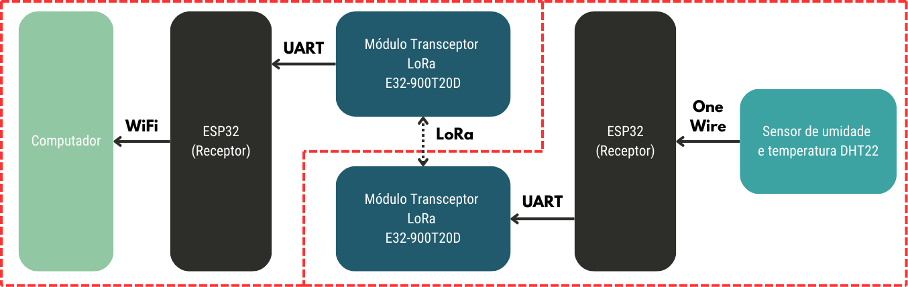

# 📂 Hardware

Neste diretório, vamos explorar os componentes utilizados em nosso projeto e como eles estão conectados.

Abaixo, você verá um diagrama de blocos que resume a estrutura geral do projeto.

## 🌐 Visão Geral do Projeto

Como apresentado no diagrama acima, o projeto é composto por dois grandes blocos:

1. **Hardware**:
   - 🌡️ **Sensor de Temperatura e Umidade**
   - 📡 **Módulos de Comunicação LoRa**
   - 💻 **Microcontroladores ESP32**
   - 🔋 **Fonte de Alimentação**: Suprindo a energia necessária para todos os componentes.

2. **Software**:
   - **Firmware para ESP32 Transmissor**: Responsável por ler os dados dos sensores e transmiti-los via LoRa.
   - **Firmware para ESP32 Receptor**: Recebe dados via LoRa e os transmite via Wi-Fi para um computador (TCP).
   - **Interface de Exibição de Dados**: Para monitoramento em tempo real dos dados coletados.

---

# Descrição dos Componentes

Aqui, exploramos em detalhes os componentes utilizados no projeto e como cada um contribui para o funcionamento do sistema.

## 1. ESP32 💡

  

  Fonte: <a href="https://xprojetos.net/esp32-e-suas-versoes/">xProjetos, 2019</a>

### 📍 Descrição:
O **ESP32** é um microcontrolador poderoso da Espressif Systems, equipado com conectividade **Wi-Fi** e **Bluetooth**. Com arquitetura de 32 bits e uma grande variedade de interfaces de comunicação, como **SPI**, **I2C**, **UART**, **ADC**, **DAC**, e **PWM**, ele é ideal para sistemas embarcados de alto desempenho.

### 🔑 Razão para Utilização:
Escolhemos o **ESP32** pela sua **versatilidade**, **baixo custo** e **desempenho eficiente**. Ele é o componente central do nosso sistema, controlando todos os outros dispositivos e gerenciando a comunicação via LoRa. Sua capacidade de operar de forma autônoma com baixo consumo de energia é fundamental para um projeto de monitoramento remoto.

---

## 2. Módulo EBYTE LoRa E32900T20D 📡

  

  Fonte: <a href="https://www.cdebyte.com/products/E32-900T20D">cdebyte</a>

### 📍 Descrição:
O **Módulo LoRa E32900T20D** é um transceptor de longo alcance que utiliza a tecnologia **LoRa (Long Range)** para comunicação sem fio. Ele é projetado para transmissões de dados a longas distâncias (até 10-15 km em áreas abertas), consumindo pouca energia e oferecendo boa resistência a interferências.

### 🔑 Razão para Utilização:
Este módulo é essencial para a comunicação de longo alcance em áreas remotas, onde redes convencionais (como Wi-Fi) não são viáveis. Sua **eficiência energética** e capacidade de operar em **frequências sub-gigahertz** garantem a cobertura necessária para enviar dados do sensor a grandes distâncias, permitindo o monitoramento remoto.

---

## 3. Sensor de Temperatura e Umidade DHT22 🌡️💧

  

  Fonte: <a href="https://www.arduinoecia.com.br/sensor-de-temperatura-e-umidade-dht22/">arduinoecia, 2015</a>

### 📍 Descrição:
O **DHT22** é um sensor digital de temperatura e umidade. Ele é capaz de medir a temperatura entre -40°C e 80°C e a umidade de 0% a 100%, com boa precisão. A comunicação com o microcontrolador é feita de forma digital, através de um único pino.

### 🔑 Razão para Utilização:
O **DHT22** foi escolhido pela sua **precisão** e **facilidade de integração** com o ESP32. Ele é perfeito para capturar dados ambientais em tempo real, essenciais para o nosso projeto de monitoramento remoto. Além disso, seu custo acessível e confiabilidade tornam-no uma escolha ideal.

---

# 🛠️ Conexões

As conexões físicas foram realizadas conforme a imagem abaixo, em que a única diferença entre os entre o conjunto receptor e o transmissor é o sensor DHT22.

  

---

# 📝 Resumo da Utilização dos Componentes

Aqui está um resumo de como cada componente contribui para o sucesso do projeto:

- **ESP32**: Responsável por processar os dados dos sensores e gerenciar a comunicação via LoRa.
- **Módulo LoRa E32900T20D**: Permite a transmissão dos dados coletados a longas distâncias, utilizando a tecnologia LoRa, com baixo consumo de energia.
- **Sensor DHT22**: Mede a temperatura e a umidade, enviando essas informações ao ESP32, que as transmite via LoRa para um receptor.

Esses componentes foram escolhidos por sua **eficiência**, **baixo custo** e **fácil integração**, criando uma solução robusta e ideal para o nosso sistema de monitoramento remoto.

---

## 📚 Referências

- **Espressif Systems**. *ESP32 Wi-Fi & Bluetooth SoC*. Disponível em: [espressif.com](https://www.espressif.com/en/products/socs/esp32). Acesso em: 18 nov. 2024.
- **EBYTE**. *LoRa/WiFi/BLE/ZigBee wireless modules Manufacturers*. Disponível em: [cdebyte.com](https://www.cdebyte.com). Acesso em: 17 nov. 2024.
- **Aosong Electronics Co., Ltd.** *DHT22 Sensor*. Disponível em: [aosong.com](http://www.aosong.com/en/). Acesso em: 18 nov. 2024.
