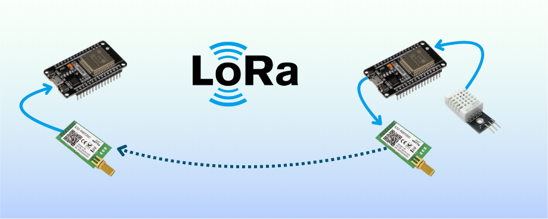

# 🌍 Desenvolvimento de um Sistema de Monitoramento de Umidade e Temperatura com Comunicação LoRa

✍️ **Autores**: João Victor Felipe Laporte e Gustavo Sargenti da Silva Hartmann de Andrade Neves.

---

  

## 📌 Visão Geral

Este projeto tem como objetivo o **desenvolvimento de um sistema de monitoramento de umidade e temperatura** utilizando **comunicação LoRa** (Long Range) sem a necessidade de um gateway intermediário.

O sistema permite a coleta de dados ambientais e a transmissão dessas informações a longas distâncias, tornando-o ideal para aplicações em **agricultura de precisão, monitoramento ambiental, controle industrial e gestão de recursos hídricos**.

O diferencial deste projeto é a **utilização do protocolo LoRa**, que proporciona **baixo consumo de energia** e **alcance ampliado**, superando as limitações de outras tecnologias sem fio convencionais.

---

## 🎯 Objetivos

✅ Criar uma rede de sensores para medição de **umidade** e **temperatura**.
✅ Desenvolver uma comunicação eficiente utilizando **módulos LoRa**.
✅ Garantir **baixo consumo de energia** para operação prolongada.
✅ Testar o **alcance e a confiabilidade** da comunicação LoRa em diferentes cenários.
✅ Criar uma interface para **visualização remota** dos dados.

---

## 🏗️ Estrutura do Repositório

O repositório está organizado da seguinte forma:

📁 **Componentes_e_conexoes** ➝ Especificação dos sensores, módulos LoRa e esquema de conexão.

📁 **Firmware** ➝ Código para transmissão e recepção de dados via LoRa.

📁 **Interface_web** ➝ Desenvolvimento da interface para visualização dos dados.

📁 **Ensaios** ➝ Testes e experimentos realizados para avaliar o desempenho do sistema.

---

## 📡 Por que LoRa?

🔹 **Alcance estendido** ➝ Permite comunicação em longas distâncias (km) sem a necessidade de infraestrutura complexa.

🔹 **Baixo consumo de energia** ➝ Ideal para aplicações IoT em locais remotos.

🔹 **Alta confiabilidade** ➝ Robustez contra interferências e operação eficiente em ambientes desafiadores.

🔹 **Custo reduzido** ➝ Evita o uso de redes celulares ou Wi-Fi, diminuindo custos operacionais.

---

## 🏆 Impacto do Projeto

🔬 **Pesquisa & Desenvolvimento** ➝ Contribui para o avanço de soluções sem fio para monitoramento remoto.

🌱 **Sustentabilidade** ➝ Monitoramento preciso pode ajudar na conservação de recursos naturais.

🚜 **Agricultura Inteligente** ➝ Possibilita uma gestão mais eficiente de irrigação e condições ambientais.

---

## 🚀 Vamos Começar!

Para mais informações sobre a configuração do hardware e software, consulte a documentação em cada pasta do repositório.

Caso tenha dúvidas ou sugestões, sinta-se à vontade para contribuir! 😊

